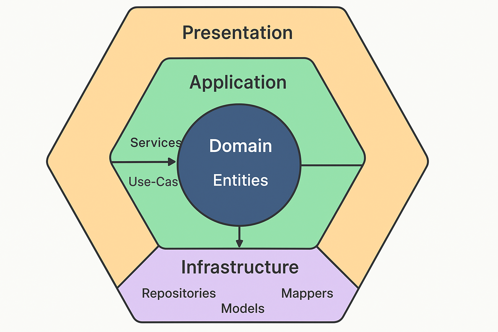

Proyecto  Backend Base Driver Clean
Nest js

Node version 20.19.2

Controller → Service → Repository → Database

## 📐 Arquitectura del Proyecto
Clean Hexagonal Architecture Diagram

## Configuracion de la base de datos 
src/infrastructure/infrastructure/sequelize.config.ts
Cambie en este archivo a sus credenciales de base de datos postgres
src/infrastructure/infrastructure/sequelize-cli.config.js (Para ejecutar migraciones)
npx sequelize-cli db:migrate

## Ejecutar el proyecto
npm run start:dev

## Configuracion de plop en el proyecto
Ejemplo

| Capa           | Comando                                    |
| -------------- | ------------------------------------------ |
| Entity         | `npx plop entity --name demo`         |
| Model          | `npx plop model --name demo`          |
| Repository     | `npx plop repository --name demo`     |
| RepositoryImpl | `npx plop repositoryImpl --name demo` |
| Service        | `npx plop service --name demo`        |
| Controller     | `npx plop controller --name demo`     |

npx plop crud --name demo

ESTRUCTURA FINAL DEL PROYECTO

src/
├── domain/
│   ├── entities/
│   │   ├── user.entity.ts
│   │   ├── cliente.entity.ts
│   │   ├── factura.entity.ts
│   ├── repositories/
│
├── application/
│   ├── use-cases/
│   │   ├── crear-factura.usecase.ts
│   │   ├── registrar-venta.usecase.ts
│
├── infrastructure/
│   ├── database/
│   │   ├── sequelize.config.ts
│   │   ├── models/
│   ├── repositories/
│
├── presentation/
│   ├── controllers/
│   ├── dtos/
│
└── main.ts
